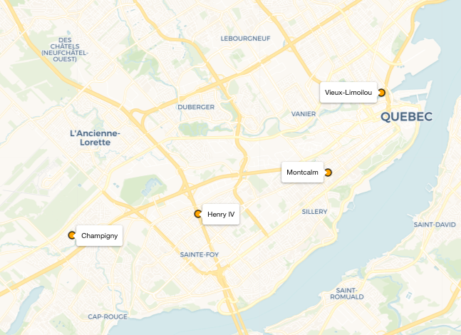
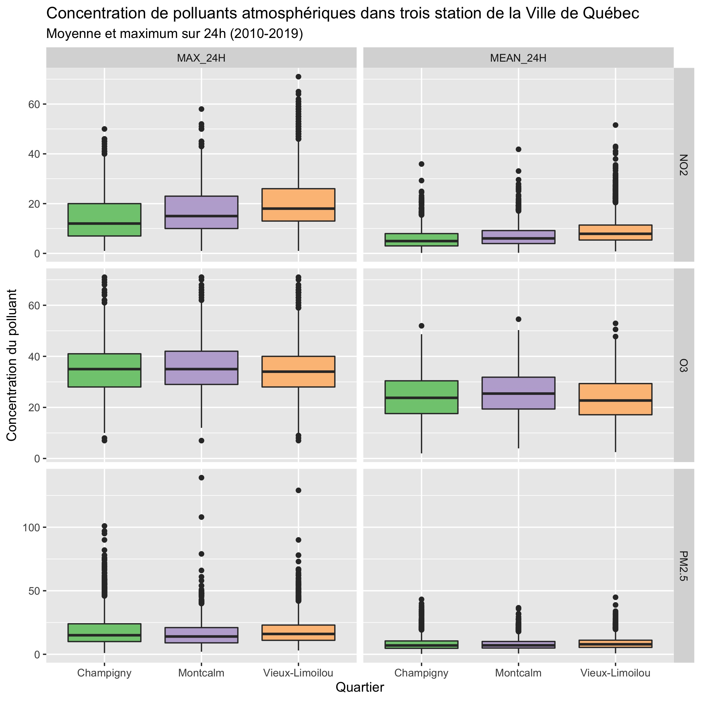

Pollution de l'air à Limoilou, Québec 🏭💨
================================================================================

Le quartier Limoilou de Québec fait les manchettes ces temps-ci, étant donné que le Gouvernement du Québec veut modifier les lois pour augmenter les taux de nickel pouvant être émis dans l'atmosphère. Le quartier Limoilou est déjà victime de nombreux autres polluants provenant des activités municipales (incinérateur) et indsutrielles (Port de Québec) à proximité.

Afin d'élargir le débat sur le nickel, il ne faut pas regarder seulement les taux de nickel à Limoilou, mais aussi tous les autres polluants atmosphériques. 

__Mon but :__ fournir une comparaison de la qualité de l'air à Limoilou avec les autres quartiers de Québec. 

> __Disclaimer #1__ : Je suis un fier résident du quartier Limoilou. J'aimerais donc que les résultats montrent que l'air est moins polluée qu'on le pense ou que sa qualité s'est améliorée dans les dernières années. Néanmoins, je laisserai les données parler et je me tiendrai loin de toute partisanerie.

> Disclaimer #2 : Cette analyse n'est nullement associée à la Ville de Québec, au Ministère de l'Environnement et de la Lutte aux Changements Climatiques (MELCC) ou à Environnement et Changements Climatiques Canada (ECCC).

Données
--------------------------------------------------------------------------------

J'ai téléchargé les données de pollution de l'air de `1979` à `2020` du [Programme de surveillance national de la pollution atmosphérique](https://data.ec.gc.ca/data/air/monitor/national-air-pollution-surveillance-naps-program/?lang=fr) (NAPS) de toutes les stations au Canada pour les polluants atmosphériques suivants : O3, NO2, SO2, CO, PM2.5 et PM10 (scripts 1 et 2). 

Ensuite, j'ai filtré les stations qui étaient situées dans la Ville de Québec (script 3) et extrait quelques statistiques sommaires sur le # d'observations quotidiennes pour les 6 polluants dans la période `2010` à `2020`, et j'ai affiché les stations sur une carte pour voir l'étendue géographique.

__Tableau 1 : Stations du réseau NAPS dans la ville de Québec__

| NAPSID| Nom officiel                      | Localisation  |   O3|  NO2|  SO2|  CO|  PM25| PM10|
|-------|-----------------------------------|---------------|-----|-----|-----|----|------|-----|
|  50308|QUÉBEC-VIEUX-LIMOILOU (DES SABLES) |Vieux-Limoilou | 4017| 4017| 4017| 4017| 4382|    0|
|  50310|QUÉBEC-COLLÈGE ST-CHARLES-GARNIER  |Montcalm       | 4017| 1825|    0|    0| 4382|    0|
|  50311|QUÉBEC-ÉCOLE LES PRIMEVÈRES        |Champigny      | 4017| 1825|    0|    0| 4382|    0|
|  50313|QUÉBEC-HENRI IV                    |Henry IV       |  731|  731|  731|  731|  731|    0|

**Figure 1 : Localisation des stations**

Résultats
--------------------------------------------------------------------------------

**Figure 2** : Distribution des 3 polluants (O3, PM2.5 et NO2) disponibles aux trois stations de Québec pour la période 2000-2019

Conclusion
--------------------------------------------------------------------------------

Pistes futures
--------------------------------------------------------------------------------

**Enjoy !** ✌🏻
